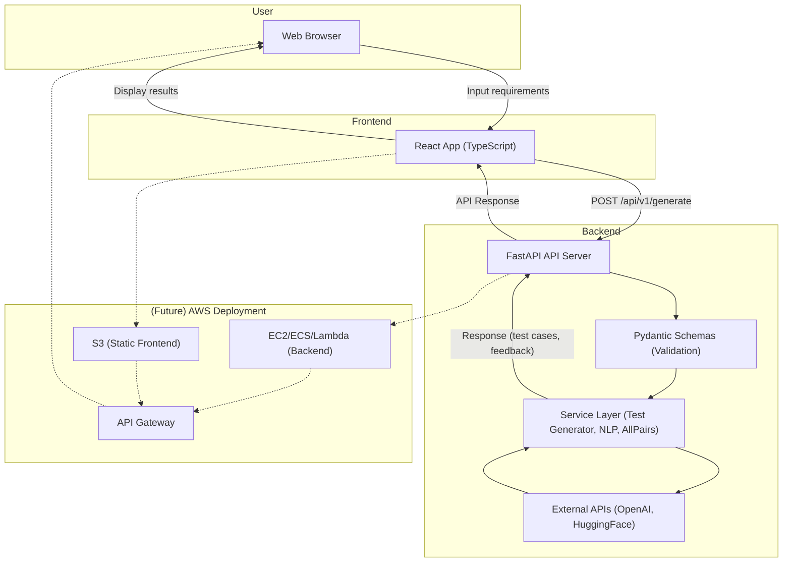

# TestMIND 

<div align="center">
  

  [](https://github.com/berkde/testmind/actions/workflows/backend.yml)
  [](https://opensource.org/licenses/MIT)
  [](https://www.python.org/downloads/)
  [](https://fastapi.tiangolo.com/)
  [](https://reactjs.org/)
  
  


</div>

## Project Description

**TestMIND** (Test Management, Integration, and Natural Development) is an AI-assisted tool designed to generate structured software test cases from natural language feature descriptions. It bridges the gap between human requirements and automated testing by combining Natural Language Processing (NLP) and rule-based logic.

Our mission is to streamline the software testing process by automatically generating comprehensive test suites from plain English requirements, saving development teams valuable time and ensuring thorough test coverage.

### Why TestMIND?

- **Reduce Manual Test Writing**: Automatically generate test cases from requirements
- **Improve Test Coverage**: Ensure all edge cases and scenarios are considered
- **Standardize Testing Approach**: Create consistent test cases across projects
- **Accelerate Development**: Integrate seamlessly with CI/CD pipelines

---

##  Features

- Generate positive, negative & edge test cases from natural language descriptions
- Support for AllPairs test reduction to optimize test suite size
- Interactive UI to edit, save, and export test suites in various formats
- Visual test coverage feedback and reporting
- Integration with popular testing frameworks and CI/CD pipelines
- **🎤 Speech-to-Text Support**: Voice input and audio file transcription for hands-free interaction

---

##  Tech Stack

| Layer       | Tech                      |
|------------|---------------------------|
| Backend    | Python, FastAPI, HuggingFace Transformers, OpenAI |
| Frontend   | React, TypeScript         |
| ML Models  | Custom NLP Pipelines via HuggingFace |
| API Access | OpenAI GPT API            |
| Testing    | Pytest, React Testing Library |
| CI/CD      | GitHub Actions            |

---

##  Architecture

<details>
<summary>Click to expand</summary>

<pre>
graph TD
A[Natural Language Requirements] --> B[FastAPI Backend]
B --> C[HuggingFace NLP Pipeline]
C --> D[OpenAI GPT API]
B --> E[Test Case Generator]
D --> G[React Frontend (UI)]
</pre> </details>

## System Connectivity Diagram


<details>
<summary>Click to expand</summary>

This diagram illustrates how user input flows through the TestMIND system, from the React frontend to the FastAPI backend, through the service layer, and back to the user. It also references a potential future AWS deployment architecture.



*Solid arrows* show the main data flow. *Dashed arrows* indicate possible AWS deployment targets for frontend and backend components.
</details>

## Repository Structure

<details>
<summary>Click to expand</summary>

<pre>
testmind/
├── backend/
│   ├── __init__.py
│   ├── app/
│   │   ├── __init__.py
│   │   ├── api/
│   │   │   ├── __init__.py
│   │   │   └── endpoints.py
│   │   ├── core/
│   │   │   ├── __init__.py
│   │   │   ├── agent.py
│   │   │   ├── config.py
│   │   │   ├── testcase_generator.py
│   │   │   └── workflow.py
│   │   ├── main.py
│   │   ├── models/
│   │   │   ├── __init__.py
│   │   │   ├── error.py
│   │   │   ├── event.py
│   │   │   └── schemas.py
│   │   ├── services/
│   │   │   ├── __init__.py
│   │   │   └── handler.py
│   │   ├── utils/
│   │   │   ├── __init__.py
│   │   │   └── all_pairs.py
│   ├── README.md
│   ├── requirements.txt
│   └── tests/
│       ├── __init__.py
│       ├── conftest.py
│       ├── demo_complex_matrix.py
│       ├── demo_matrix.py
│       ├── pytest.ini
│       ├── README.md
│       ├── test_generator.py
│       ├── test_handler.py
│       └── test_simple.py
├── banners/
│   ├── adam.png
│   ├── banner.png
│   ├── berk.png
│   ├── jiawei.png
│   └── lori.png
├── frontend/
│   ├── eslint.config.js
│   ├── index.html
│   ├── package.json
│   ├── public/
│   │   └── banner.png
│   ├── README.md
│   ├── src/
│   │   ├── App.css
│   │   ├── App.jsx
│   │   ├── assets/
│   │   │   ├── adam.png
│   │   │   ├── berk.png
│   │   │   ├── jiawei.png
│   │   │   └── lori.png
│   │   ├── components/
│   │   │   ├── Card.css
│   │   │   ├── Card.jsx
│   │   │   ├── Header.css
│   │   │   └── Header.jsx
│   │   ├── index.css
│   │   ├── main.jsx
│   │   └── pages/
│   │       ├── Contact.css
│   │       ├── Contact.jsx
│   │       ├── Home.css
│   │       └── Home.jsx
│   ├── vite.config.js
├── LICENSE
├── README.md

</pre>
</details>

## Getting Started

### Prerequisites

- Python 3.11
- Node.js 14.x or higher
- OpenAI API key
- HuggingFace API key (optional)

### Quick Start

1. Clone the repository:
   ```bash
   git clone https://github.com/berkde/testmind.git
   cd testmind
   ```

2. Set up the backend:
   ```bash
   cd backend
   python -m venv venv
   source venv/bin/activate  # On Windows: venv\Scripts\activate
   pip install -r requirements.txt
   ```

3. Set up the frontend:
   ```bash
   cd ../frontend
   npm install
   ```

4. Create environment files:
   - Backend `.env` file with OpenAI API key
   - Frontend `.env` file with API URL

5. Start the services:
   - Backend: `uvicorn app.main:app --reload`
   - Frontend: `npm start`

### Speech-to-Text Features

TestMIND now supports voice input for a more natural interaction experience:

- **Real-time Voice Input**: Click the microphone button to start voice recognition
- **Audio File Upload**: Upload audio files (WAV, MP3, M4A, FLAC, OGG, WEBM) for transcription
- **Browser Compatibility**: Works with Chrome, Edge, Safari, and other modern browsers
- **Automatic Text Insertion**: Transcribed text is automatically added to the input field

**Note**: Speech recognition requires microphone permissions and works best in quiet environments.

For detailed setup instructions, see the [Backend README](backend/README.md) and [Frontend README](frontend/README.md).

## Team Members

<div align="center">
  <table>
    <tr>
      <td align="center">
        <a href="https://github.com/lms651">
          
          <br />
          <sub><b>Lori Schmidt</b></sub>
        </a>
        <br />
        <sub>Team Lead</sub>
      </td>
      <td align="center">
        <a href="https://github.com/berkde">
          
          <br />
          <sub><b>Berk Delibalta</b></sub>
        </a>
        <br />
        <sub>Lead Engineer and Architect</sub>
      </td>
      <td align="center">
        <a href="https://github.com/adamc95">
          
          <br />
          <sub><b>Adam Cebulski</b></sub>
        </a>
        <br />
        <sub>QA Engineer</sub>
      </td>
      <td align="center">
        <a href="https://github.com/jxc1687">
          
          <br />
          <sub><b>Jiawei Cheng</b></sub>
        </a>
        <br />
        <sub>Frontend Engineer</sub>
      </td>
    </tr>
  </table>
</div>

## Build Status

| Component | Status |
|-----------|--------|
| Backend   | [](https://github.com/berkde/testmind/actions/workflows/backend.yml) |
| Frontend  |  Coming Soon |

##  License

This project is licensed under the MIT License - see the [LICENSE](LICENSE) file for details.

##  Contact

For questions or feedback, please open an issue or contact the project maintainers.
